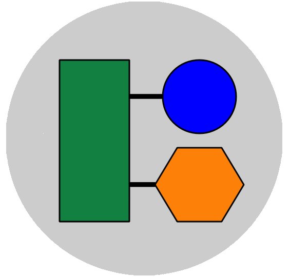

# Circuit Creator
A simple way to organize components and plan wiring patterns in a project before actually assembling

#

  

###  

## Key Bindings
| Key Combination | Description| Version Added|
| --- | --- | --- |
| `Command+S` | Save Workspace | 2.1.0 |
| `Command+Option+S` | Save Workspace As | 2.1.0 |
| `Command+O` | Load Workspace | 2.1.0 |
| `Command+N` | New Workspace | 2.1.0 |
| `Command+W` | Save and Exit | 2.1.0 |
| `Command+Option+W` | Exit Without Saving | 2.1.0 |
| `Command+C` | New Component | 2.1.0 |
| `Command+E` | Export Workspace | 2.3.0 |

## Release Notes

### [Version 2.3.1 (May 2022)](https://github.com/rohandharwadker/CircuitCreator/commit/6a0d681740e1edae5ec781110502efba3894ea32)
- Replace 'Save & Exit' button with 'Export Workspace' button
- Bug fixes

### [Version 2.3.0 (May 2022)](https://github.com/rohandharwadker/CircuitCreator/commit/a38d454590daa5df1042974678b73e8594079650)
- Export Workspaces to .PNG Files
- Bug Fixes

### [Version 2.2.0 (April 2022)](https://github.com/rohandharwadker/CircuitCreator/commit/af87890d128dc309f0f913d72296f3c8f40b69ec)
- Add 'Configure Menu'
- Save user preferences on any close, regardless of save
- Add Logo
- Bug Fixes

### [Version 2.1.0 (April 2022)](https://github.com/rohandharwadker/CircuitCreator/commit/e9445fd5a673d88ee75032183a5c3b4cbfb8037f)
- Save/Load Workspaces
- New Key bindings
    - Command+S - Save Workspace
    - Command+Option+S - Save Workspace As
    - Command+O - Load Workspace
    - Command+N - New Workspace
    - Command+W - Save & Exit
    - Command+Option+W - Exit Without Saving
    - Command+C - New Component
- Bug Fixes

### [Version 2.0.1 (April 2022)](https://github.com/rohandharwadker/CircuitCreator/commit/1b70fa576bad6319c9e6d60e4b4bc696f4126406)
- Add menu bar
- Bug fixes

### [Version 2.0.0 (April 2022)](https://github.com/rohandharwadker/CircuitCreator/commit/d5b39c44e4e0a9f2e12ff26b929d96bbe9ddcbe5)
- Save/Load workspace
- Minor styline changes
- Bug fixes

### [Version 1.0.2 (April 2022)](https://github.com/rohandharwadker/CircuitCreator/commit/4ce07504ccf35c436275740df7a7ab9be90073f5)
- Minor styling changes

### [Version 1.0.1 (April 2022)](https://github.com/rohandharwadker/CircuitCreator/commit/5b17b98593017440ea83a52ba37a4aec62b01ca2)
- Fix component name appearing below pin names
- Fix formatting inconsistency in alerts
- Fix console outputting debugging content